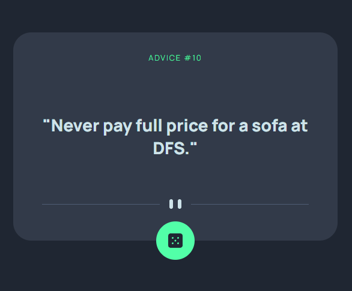

This is a solution to the [Advice generator app challenge on Frontend Mentor](https://www.frontendmentor.io/challenges/advice-generator-app-QdUG-13db). Frontend Mentor challenges help you improve your coding skills by building realistic projects.

## Table of contents

- [Overview](#overview)
  - [The challenge](#the-challenge)
  - [Screenshot](#screenshot)
  - [Links](#links)
- [My process](#my-process)
  - [Built with](#built-with)
  - [Code Explanation](#code-explanation)
  - [Useful resources](#useful-resources)
- [Author](#author)

## Overview

### The challenge

Users should be able to:

- View the optimal layout for the app depending on their device's screen size
- See hover states for all interactive elements on the page
- Generate a new piece of advice by clicking the dice icon

### Screenshot

### Links

- [Solution URL](https://www.frontendmentor.io/solutions/advice-app-with-api-and-responsive-layout-tnD03gx4zd)
- [Live Site URL](https://rickhalmoguera.github.io/Advice-generator-react/)

## My process

### Built with

- Semantic HTML5 markup
- CSS custom properties
- Flexbox
- CSS Grid
- Mobile-first workflow
- ReactJS

## Code Explanation

### App Component

```js
import { useState, useEffect } from 'react'
import { getRandomAdvice } from './services/advices'
import dividerDesktop from './assets/pattern-divider-desktop.svg'
import dividerMobile from './assets/pattern-divider-mobile.svg'
import dice from './assets/icon-dice.svg'
import './App.css'

function App() {
  const [advice, setAdvice] = useState({})

  useEffect(() => {
    getRandomAdvice().then(setAdvice) 
  },[]);

  const handleClick = () => {
    getRandomAdvice().then(setAdvice)
  }
```
HEre I define a component named App that makes use of the useState and useEffect hooks from React. It also defines a function named handleClick.

The component initializes a state variable advice using useState hook with an empty object as the initial value. This state variable will be used to store the advice retrieved from the API.

The useEffect hook is used to fetch a random piece of advice when the component mounts. This is achieved by calling the getRandomAdvice function, which returns a Promise that resolves to an advice object. The then method is used to set the state variable advice with the returned advice object.

The second parameter to useEffect is an empty array, indicating that this effect should only be run once, when the component mounts.

The handleClick function is triggered when the user clicks on a button or any other element that has an onClick handler attached to it. It also calls the getRandomAdvice function and sets the state variable advice with the returned advice object.

This allows the user to retrieve a new random piece of advice by clicking on a button or any other element with an onClick handler.

### advice.js 

```js
const API_URL='https://api.adviceslip.com/advice'

export async function getRandomAdvice() {
    try{
        const response=await fetch(API_URL)
        const data=await response.json()
        return data.slip
        
    }catch(error){
        console.log(error)
    }

}
```

This code defines a function named getRandomAdvice that retrieves a random piece of advice from an external API. The API URL is stored in a constant variable named API_URL.

When getRandomAdvice is called, it sends a GET request to the API endpoint using the fetch method. This method returns a Promise, so the code uses the await keyword to wait for the response before proceeding.

Once the response is received, the code uses the json method to extract the JSON data from the response. This data is then returned as an object with a property named slip.

If an error occurs during the request or data processing, the code catches the error and logs it to the console.

### API response
```js
  {
    "slip": {
      "slip_id": "2",
       "advice": "Smile and the world smiles with you. Frown and you're on your own."
    }
  }
```
### App Component return
```js
  return (
  <main>
    <h1>advice #{advice.id}</h1>
    <p>"{advice.advice}"</p>
    <picture>
      <source media='(min-width:450px)' srcSet={dividerDesktop} />
      
    </picture>
    <button onClick={handleClick}>
      
    </button>

  </main>
  )
}
```

This code returns a JSX (JavaScript XML) element that represents the main content of the App component. It includes an h1 element that displays the ID of the current advice object retrieved from the API, a p element that displays the text of the advice, a picture element that displays an image, and a button element that allows the user to retrieve a new random piece of advice.

The h1 element uses the advice state variable to display the ID of the current advice object. This is achieved using string interpolation, where the value of advice.id is inserted into the text of the h1 element.

The p element uses the advice state variable to display the text of the advice. This is also achieved using string interpolation, where the value of advice.advice is inserted into the text of the p element.

The picture element displays an image that changes based on the size of the viewport. If the viewport width is greater than or equal to 450 pixels, the dividerDesktop image is displayed. Otherwise, the dividerMobile image is displayed. This is achieved using the source element with the media attribute and the srcSet attribute.

The button element displays an image of a dice and has an onClick handler attached to it. When the user clicks on the button, the handleClick function is called, which retrieves a new random piece of advice from the API and updates the advice state variable. This allows the user to retrieve a new piece of advice by clicking on the button.

## Useful resources

- [Drop shadow generator](https://webcode.tools/generators/css/drop-shadow) - This helped me to make the shadow effect in the button.
- [JavaScript Fetch API](https://www.w3schools.com/jsref/api_fetch.asp) - This is an amazing article which helped me finally understand the use of fecth.
- [REACT ⚛️ CURSO Práctico DESDE CERO - Desarrolla una app con React.js PASO A PASO](https://www.youtube.com/watch?v=4AFOCAgywLc) - This short course help me to understand how to fetch in React using useState() and useEffect()


## Author

- Github - [Ricardo Halmoguera](https://github.com/RickHalmoguera)
- Frontend Mentor - [@RickHalmoguera](https://www.frontendmentor.io/profile/RickHalmoguera)
